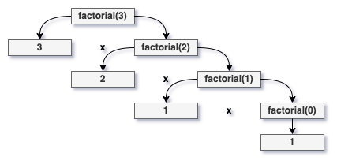

# Discussion 07: Recursion

This week, we covered the idea of recursion. It may seem a little daunting at first, but rest assured it becomes easier over time!

## Introduction

What *is* recursion?

> Recursion is a problem solving technique in which we solve a task by reducing it to smaller tasks (of the same kind). Then, use the same approach to solve the smaller tasks.
>
> Technically, a recursive function is one that **calls itself**.

General Form:

> **Base Case**
>
> - Solution for a **trivial case**.
>
> - Can be used to stop the recursion (prevents "stack overflow).
>
> - Every recursive algorithm needs **at least one** base case.
>
> **Recursive Calls**
>
> - Divide the problem into **smaller instance(s)** of the **same structure**.

## Example: The Factorial Function

Let's take a look at an actual recursive function - factorial. The factorial function is a great example to use for recursion, as the formula itself (shown below) indicates a base case.

> n! = n × (n - 1) × (n - 2) × ... × **1**

If we translate that formula into C++ code, we get something that looks like this...

```c++
int factorial (int n) {
    // Base case
    if (n == 0) {
        return 1;
    }

    // Recursive call
    return factorial(n - 1) * n;
}
```

But what's actually happening here? Well, it's much easier to understand a recursive function if you draw out its recursion tree. We start our tree at the root, or the initial value passed to the function, and proceed to create branches based off of all the values returned by each recursive call.

For example, the tree below depicts a call to our factorial function given n = 3...



## Exercise(s)

Now that we have a general idea about what recursion is and how to approach it, let's try some other recursive programs!

1. Implement the function ``int fibonacci (int n)`` so as to return the proper number in the Fibonacci sequence. You may test your output using the following few samples (the full Fibonacci sequence is a quick Google away!)...
    - fibonacci(5) == 5
    - fibonacci(6) == 8
    - fibonacci(7) == 13

2. Given the starter code below, finish the ``sum_of_arr`` function so it recursively calculates and returns the sum of all integers in the list. *Hint - think pointer arithmetic!*

   ```c++
   #include <iostream>
   
   int sum_of_arr (int * array, int size);

   int main () {
    int array[] = {1, 2, 3, 4, 5};
    
    std::cout << "The sum of the array {1, 2, 3, 4, 5} is " << sum_of_arr(array, 5) << std::endl;
    
    return 0;
   }

   int sum_of_arr (int * array, int size) {
    // Write your code here!
   }```
